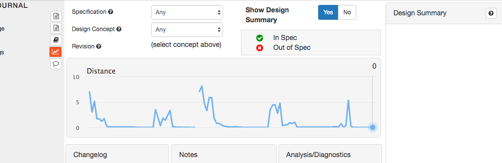
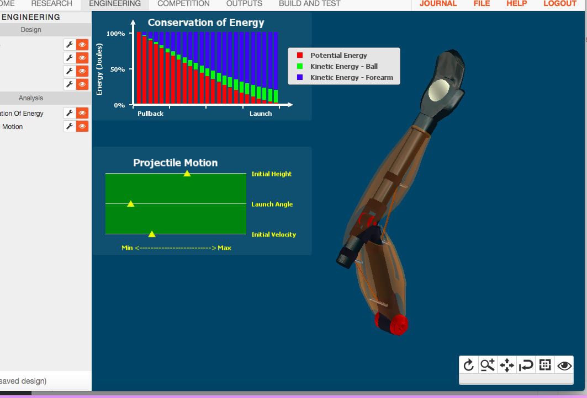
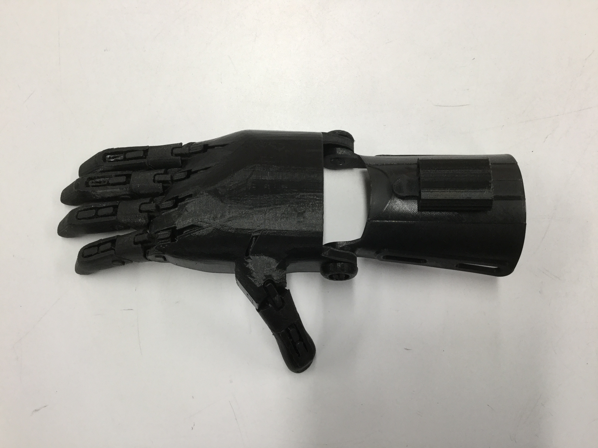
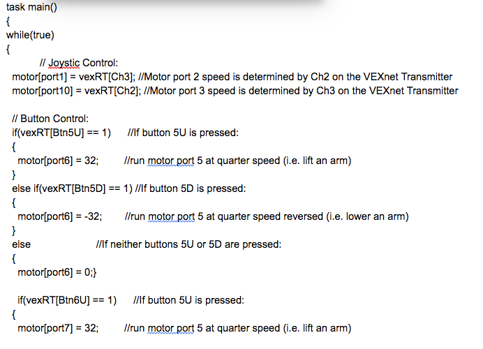
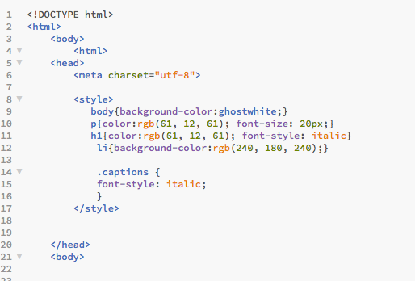

<!DOCTYPE html>
<html>
    <body>
        <html>
    <head>
        <meta charset="utf-8">
        
        
        
        
    </head>
    <body> 
        
    
        <title>My digital Portfolio♥</title>
    
    <h1>Hi! Welcome to my website</h1>
        
    <h2>I loved this class and the amazing projects we have done this year!</h2>
        
    
My digital Portfolio is here to show you all the fun things i've done this year! Mrs. Trout has enriched us with the wonders of programming and i want to show you it all. My personal favorite was SketchUp because I love design and art.

        

        
        
The links to all my projects:

        
        <ul> 
            <li><a target="_blank"
            href="https://www.whiteboxlearning.com/">WhiteBox Learning</a>  
            </li>
            <li><a target="_blank"
            href="https://www.sketchup.com/"> SketchUp</a>
            </li>
        </ul>
        
        
        <h1>White Box learning project!</h1>
        
In this project we learned about prosthetics. We desinged and tested prosthetics virtually on the computer. Then we made a model of our creation.

        
    
         
        
 Trial and error chart for White Box 

        
        
         
        
        
 Digital Prosthetic Arm

        
        
        <h1>3D Modeling and Printing project!</h1>
        
We used 3D modeling online to create objects, adapters, rings, and buildings. Unfortunately all my work was deleted and my project :(. But I have some fun photos of the project.

        
       <ul>
        <li><a target="_blank"
            href="https://www.sketchup.com/"> SketchUp</a>
            </li>
        </ul>
        
        
           
        
Real prosthetic!

                
        
        <h1>Vex Robotics!</h1>
        
IN this project we explored the world of robots and and programmming. We built and programmed robotos, my was named thai, our robots picke and threw footballs. We played and did a competition with our robots. It was so much fun!

        
        
           
        
Coding!

        
        
           
        
Me and My friends with our robot!

        
        
           
        
My robot thai in love with chai!

        
        <h1>MY WEBSITE!</h1>
        
We used Khan Academy and Studio Web to learn about making a website. I used basic coding like CSS and HTML to create this website. I used brackets to actually create the website. I have enjoyed this project so much. This year has been AMAZING and tech class made it even better. Thank you for coming onto my website!!

        
        
           
        
MY CODING!

    
        
                
        
        
My top three projects in tech were:

        
        <ol>
        <li>Vex Robotics</li>
        <li>SketchUp</li>
        <li>White Box Learning</li>
        </ol>
    <h1> THANK YOU FOR VISITING!</h1>
    
    </body>
</html>
